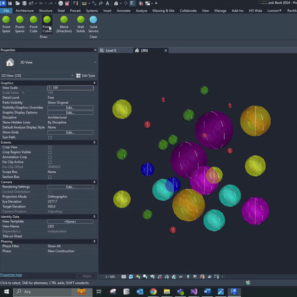
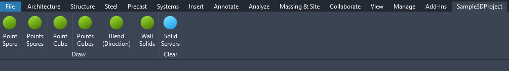
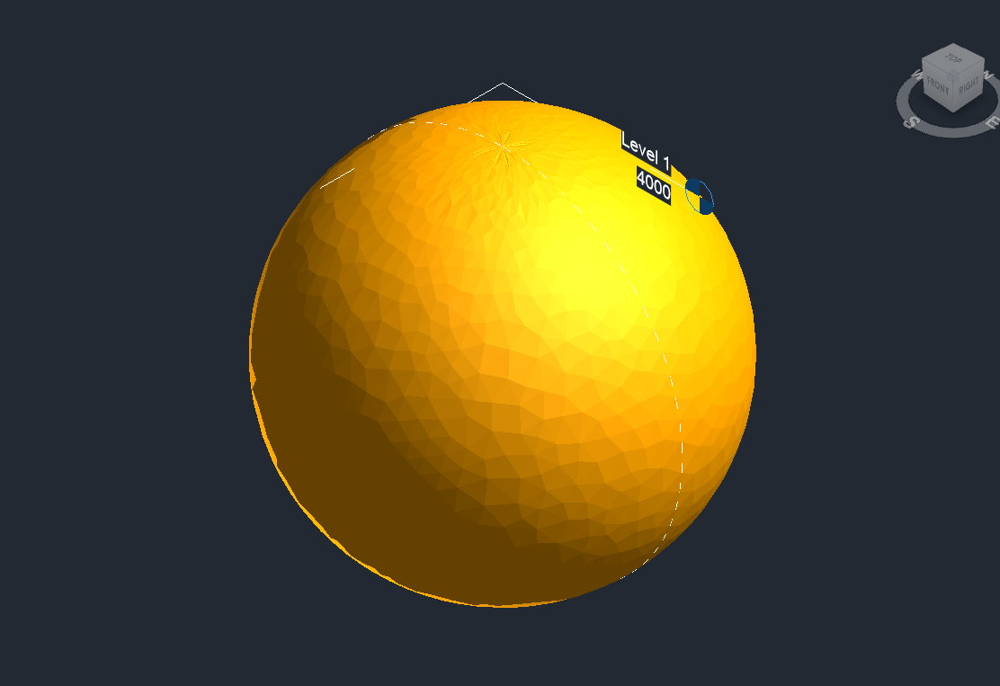
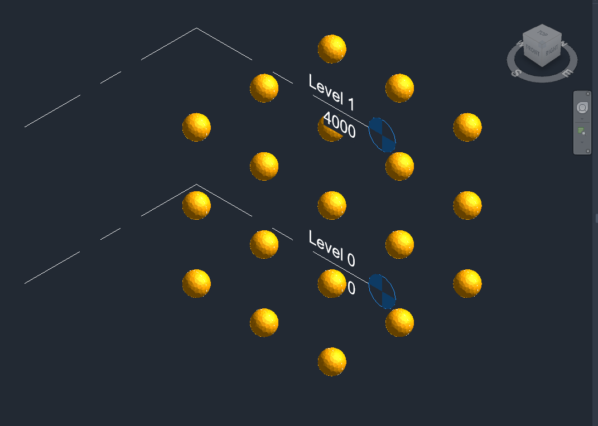
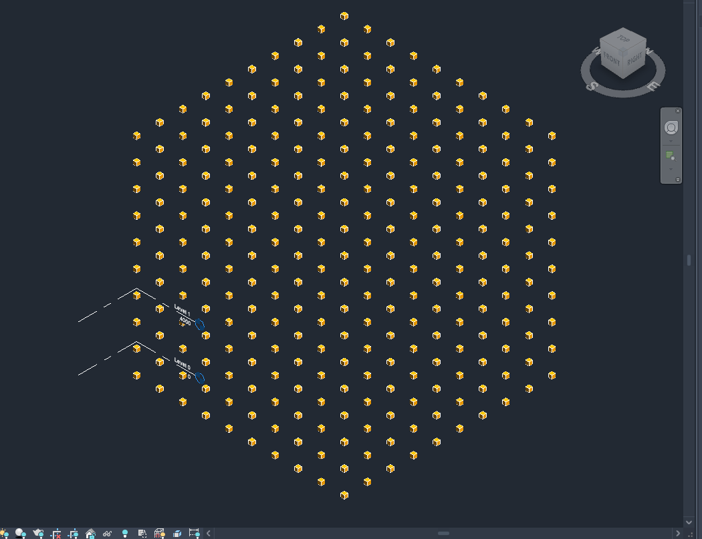
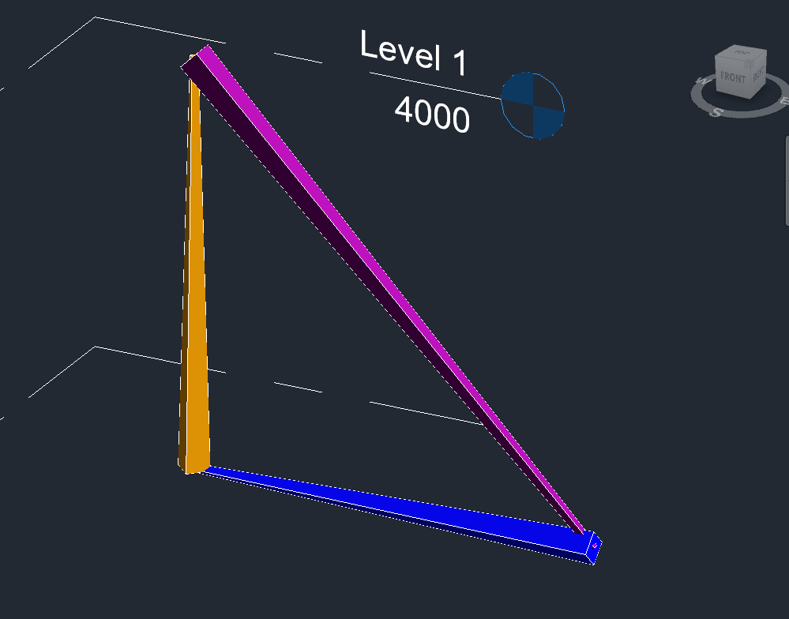
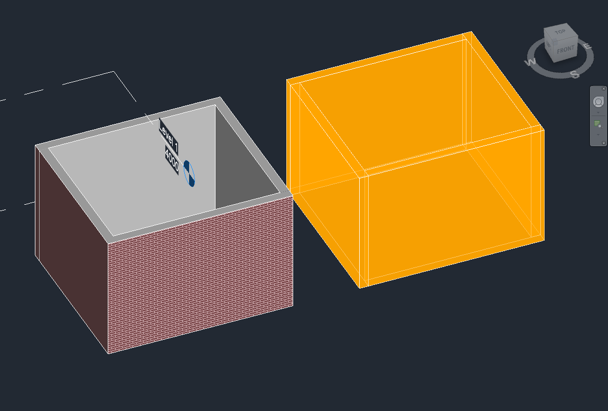

# What is Servers3dContext Library?
This library is a standalone utility library which wraps the functionality of DirectContext3D and exposes convenient
functions to draw shapes to the Revit canvas easily. It has no dependencies other than the Revit API itself. It can simply be
referenced as a Nuget package.



The package is useful for debugging purposes when the plugins or workflows which need to be developed are intensively driven by external or internal geometry data. It is also useful to inform the end-users about some geometric output or situation. The developers can easily consume the library without the hurdles of setting up the servers and boilerplate code. It can also be disposed of by simply unhooking the ServerStateMachine.

# Table of Contents
1. [What is Servers3dContext Library?](#what-is-servers3dcontext-library)
2. [What is DirectContext3D?](#what-is-directcontext3d)
3. [Sample Project](#sample-project)
4. [How to Use?](#how-to-use)
   - [Drawing](#drawing)
     - [Draw Point With Sphere](#draw-point-with-sphere)
     - [Draw Points With Spheres](#draw-points-with-spheres)
     - [Draw Point With Cube](#draw-point-with-cube)
     - [Draw Points With Cubes](#draw-points-with-cubes)
     - [Draw Blend (For Directionals)](#draw-blend-for-directionals)
     - [Draw Solid](#draw-solid)
   - [Cleaning](#cleaning)
5. [Geometry Library Considerations](#geometry-library-considerations)
6. [C++ Devs](#c-devs)
7. [Next Steps (New Packages)](#next-steps-new-packages)
8. [Autodesk License](#autodesk-license)

# What is DirectContext3D?
DirectContext3D in RevitAPI can be used to display external graphical objects directly in Revit views.

# Sample Project
I created a sample project to show how to consume the library. You can simply open the solution and run the library to quickly see how the package works in action in Revit.



# How to Use?
First, we reference the NuGet package. You can either simply install from NuGet or you can directly reference it in .csproj like this:
```xml
<ItemGroup>
	<PackageReference Include="GenFusionsRevitCore.Servers3dContext" Version="$(RevitVersion).*-*"/>
</ItemGroup>
```
If you are still not using SDK-style projects (which I don't recommend):
```xml
<Reference Include="GenFusionsRevitCore.Servers3dContext">
	<HintPath>..\packages\GenFusionsRevitCore.Servers3dContext.2022.0.0-alpha\lib\net48\GenFusionsRevitCore.Servers3dContext.dll</HintPath>
</Reference>
```
***
Now, all you need to do is hook the ServerStateMachine in your IExternalApplication:

```c#
public class SampleApp : IExternalApplication
{
	public ServerStateMachine ServerStateMachine { get; private set; }
	public static Application s_AppInstance { get; private set; }
	
	public Result OnStartup(UIControlledApplication application)
	{
		appInstance = this;
		this.ServerStateMachine = new ServerStateMachine(this);

		//... Your App Logic
		
		return Result.Succeeded;
	}

	public Result OnShutdown(UIControlledApplication application)
	{
		// ... Your shutdown logic

		return Result.Succeeded;
	}
}
```

Now, using the static app instance you can reach the ServerStateMachine from anywhere and draw from any IExternalCommand, IExternalEventHandler or IUpdater. See the commands below for examples or check out the sample project.

## Drawing
Here are sample draw calls with the end result:

### Draw Point With Sphere
```c#
ExAp.s_AppInstance.ServerStateMachine.DrawPointSphere(Document, 
                                                      point, 
                                                      RADIUS, 
                                                      new ColorWithTransparency(255,165,0,0),    // or => SimpleColors.Orange
                                                      new ColorWithTransparency(255,255,255,0)); // or => SimpleColors.White
```



### Draw Points With Spheres
```c#
ExAp.s_AppInstance.ServerStateMachine.DrawPointsSphere(Document, 
                                                       points, 
                                                       RADIUS, 
                                                       new ColorWithTransparency(255,165,0,0),    // or => SimpleColors.Orange
                                                       new ColorWithTransparency(255,255,255,0)); // or => SimpleColors.White
```



### Draw Point With Cube
```c#
ExAp.s_AppInstance.ServerStateMachine.DrawPointCube(Document, 
                                                    point, 
                                                    SIZE, 
					            new ColorWithTransparency(255,165,0,0),    // or => SimpleColors.Orange
                                                    new ColorWithTransparency(255,255,255,0)); // or => SimpleColors.White
```


### Draw Points With Cubes
```c#
ExAp.s_AppInstance.ServerStateMachine.DrawPointsCube(Document, 
                                                     points, 
                                                     SIZE, 
                                                     new ColorWithTransparency(255,165,0,0),    // or => SimpleColors.Orange
                                                     new ColorWithTransparency(255,255,255,0)); // or => SimpleColors.White
```



### Draw Blend (For Directionals)
```c#
ExAp.s_AppInstance.ServerStateMachine.DrawBlend(Document, 
                                                sp1, 
                                                sp2, 
                                                startSize, 
                                                endSize, 
                                                new ColorWithTransparency(255,165,0,0),    // or => SimpleColors.Orange
                                                new ColorWithTransparency(255,255,255,0)); // or => SimpleColors.White
```



### Draw Solid
```c#
ExAp.s_AppInstance.ServerStateMachine.DrawSolid(Document, 
                                                transformedSolid, 
                                                new ColorWithTransparency(255,165,0,0),    // or => SimpleColors.Orange
                                                new ColorWithTransparency(255,255,255,0)); // or => SimpleColors.White
```



## Cleaning
To clean all the solid servers, the following function is called:

```c#
ExAp.s_AppInstance.ServerStateMachine.ClearSolidServers();
```
# Geometry Library Considerations
I aim to keep this library dependency-free to ensure that developers can use it with ease. With the the Revit 2025 release, we are targeting .NET 8. This means we will need to maintain both .NET Framework and .NET Core for some time. I initially used third-party .NET libraries for geometry and indexed mesh structures, but they ended up causing more problems than they solved.

Currently, the library supports only simple geometries. However, in the future, I plan to port my geometry libraries from C++ to .NET. This will allow me to offer more convenient and comprehensive functions for drawing geometry. These functions will only depend on Autodesk.Revit.DB and System.Numerics, ensuring compatibility with our targeted frameworks.

# C++ Devs
Lately, I have been doing most of my proprietary work in C++ instead of .NET so I have some ideas in mind to port to .NET as open-source projects in the context of Revit and APS. It is mostly about computational geometry, multi-threading and compute pipelines which runs on the GPU. If you are proficient both in C++ and C#, and also interested, please do not hesitate to contact me to meet up.

# Next Steps (New Packages)
Apart from this library, I am planning to publish some other libraries when I have the time:
- A library to be able to populate Revit UI buttons, panels and tabs from a central database. I will provide an API to be able to easily use the following databases giving the chance to switch between data providers easily using dependency injection:
	- MySQL
	- Azure SQL Server
	- CosmosDB
	- MongoDB
  	- SQLite
  	- From Local Network
  	- Simple JSON files in local folders
- A library to show how to interact with other Processes in OS while in the Revit context.
- Multi-threading examples for performance while working with Revit

# Autodesk License
Please ensure that you adhere to Autodesk's usage permissions and licenses when using the API to avoid violating any terms of the service and platform agreements. This library is developed as a personal project to help the developers and is intended to facilitate debugging in geometry-oriented projects.


